# CGRA 2020/2021

## T02G02

Project developed by:

- André Pereira, up201905650 
- Margarida Vieira, up201907907 

Both members have contributed equally to the development of this project.

## Description

Subaquatic WebGL scene built using WebCGF that contains:

- surrounding environment (cubemap)
- sand terrain with elevations and a shell, created using a shader
- water surface with movement, created using a shader
- main fish, animated and controlable by the user using the following commands:
    - ``W`` - to move fish forward and to progressively increase fish's speed
    - ``S`` - to progressively decrease fish's speed
    - ``D`` - to turn fish in a counterclockwise direction
    - ``A`` - to turn fish in a clockwise direction
    - ``L`` - to move fish upwards
    - ``P`` - to move fish downwards
    - ``C`` - to pick a rock, if sufficiently closer, and drop it later on the shell
    - ``R`` - to reset fish to its initial position
- set of animated fishes, non-controlable by the user
- set of animated seaweed
- set of rocks, pickable by the controlable fish
- set of wood pillars, that contribute to the subaquatic ambience

In the next section, we present some representative screenshots of the elements mentioned above.

## Screenshots

### 1 - MyFish
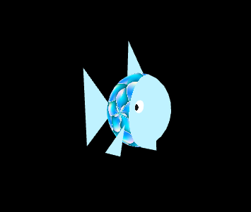 

### 2 - MySandTerrain
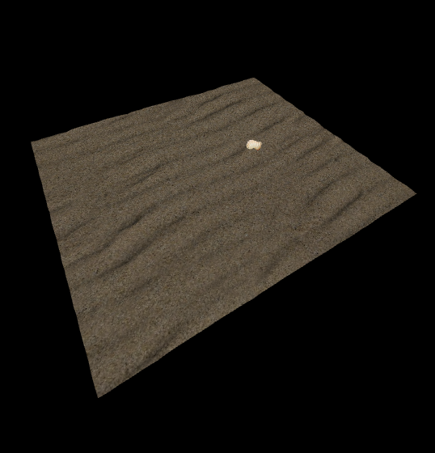

### 3 - MyWaterSurface, perspective 1
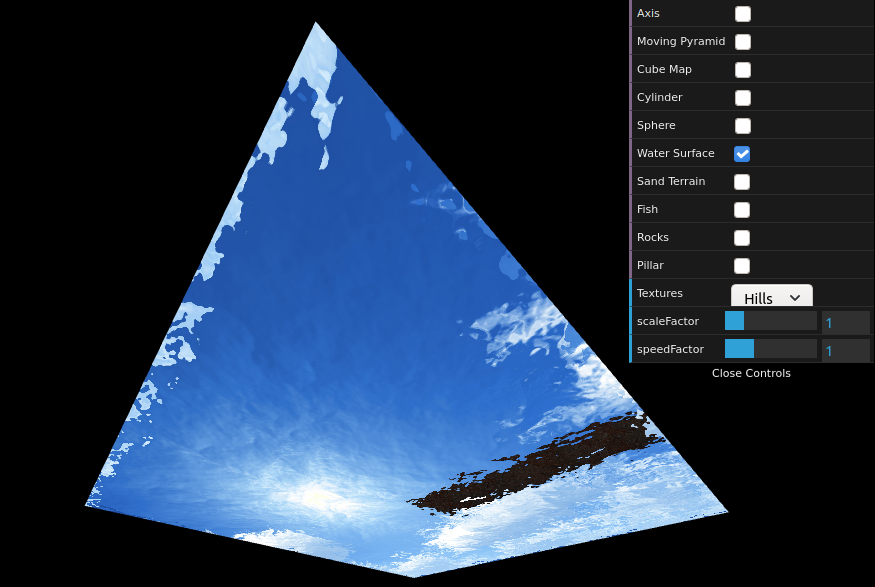

### 4 - MyWaterSurface, perspective 2
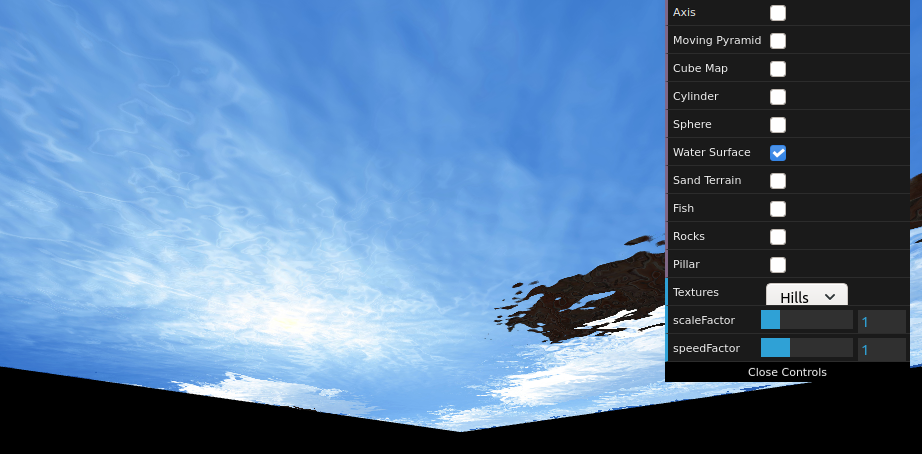

### 5 - MyRockSet, zoomed
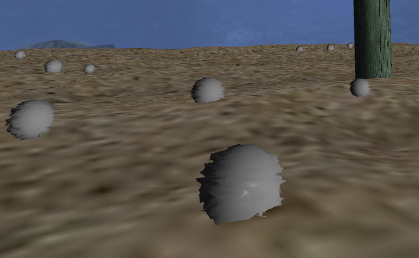

### 6 - MyRockSet
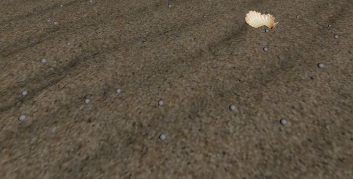

### 7 - MyWoodPilar
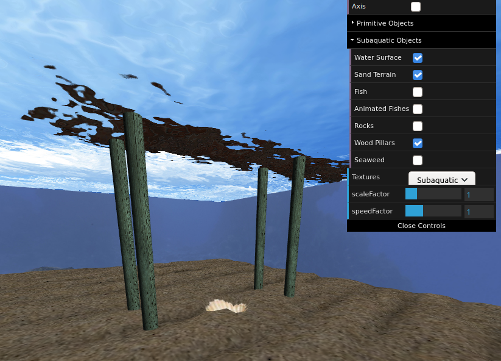

### 8 - General Scene Overview
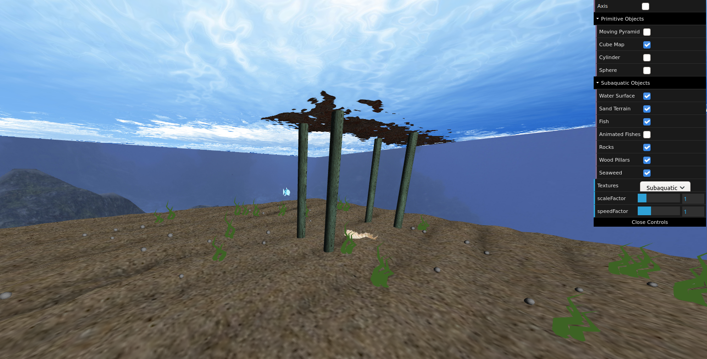

### 9 - Shell with some picked rocks
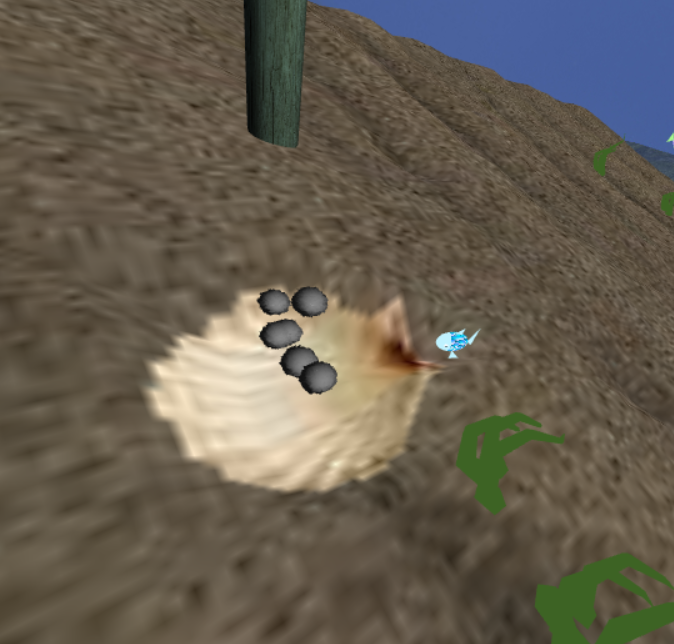

### 10 - MyAnimatedFish
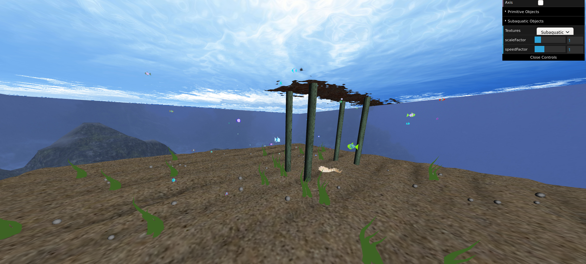

### 11 - MySeaweedSet, set of animated seaweed
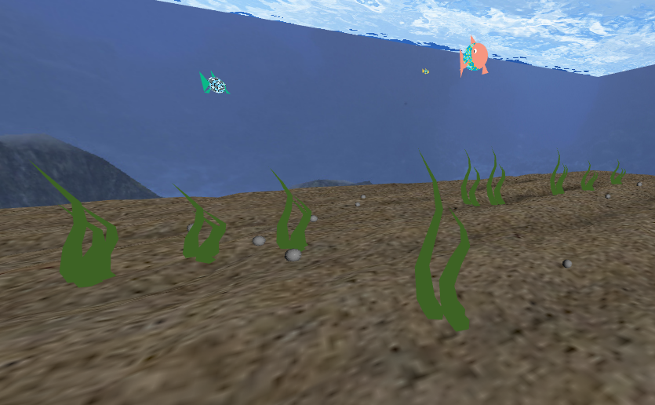
